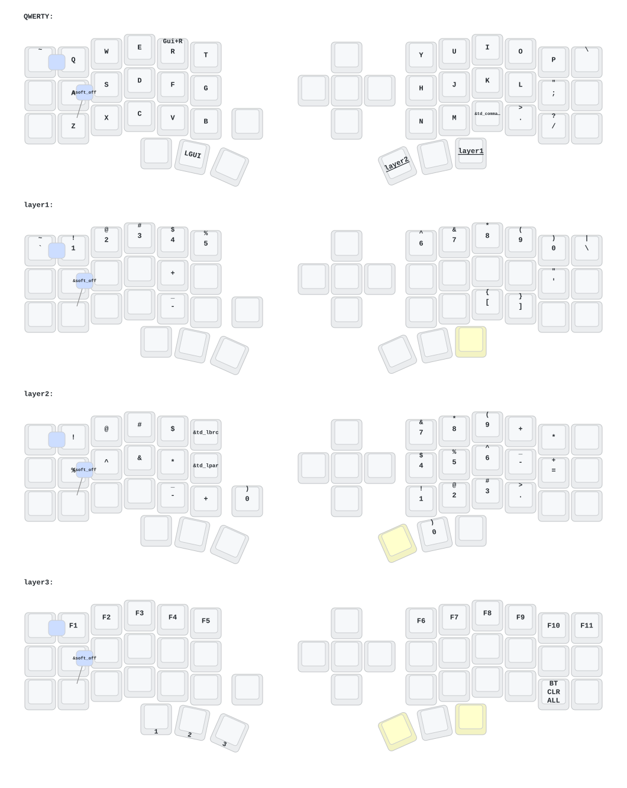

- [中文](README.md)
- [English](README_EN.md)

# 睫毛外設 (Eyelash Peripherals) Corne ZMK 倉庫

**該鍵盤與 [foostan's Corne](https://github.com/foostan/crkbd) 不同，無法與標準的 `corne` 固件兼容。**

如果您需要該鍵盤的 3D 模型，請發送電子郵件至 `380465425@qq.com`。

- 第 0 層：default_layer (QWERTY)
- 第 1 層：layer1 (NUMBER 數字及方向鍵層)
- 第 2 層：layer2 (SYMBOL 硬體控制層)

## 使用說明

1. [叉取此倉庫](https://docs.github.com/en/get-started/quickstart/fork-a-repo#forking-a-repository)。
2. [點擊 **Actions** 選項卡，確保工作流已啓用](https://docs.github.com/en/actions/managing-workflow-runs-and-deployments/managing-workflow-runs/disabling-and-enabling-a-workflow#enabling-a-workflow)。
3. 確保 [`config/west.yml`](config/west.yml) 中的 `eyelash_corne` 項目仍然有效。`boards/arm/eyelash_corne` 文件夾將從此 URL 下載。
4. 如果您的叉取中仍存在 `boards/arm/eyelash_corne` 文件夾，請將其刪除。

**如果您已經有 ZMK 配置倉庫，[您可以將此作為模塊添加，而不是叉取](https://zmk.dev/docs/features/modules#building-with-modules)。**

## Corne 鍵位圖

